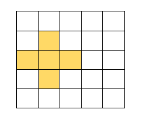

# Lights Out Game

## What is it? 
"Lights Out" is a game from the 90's where the object is to take a 5x5 grid of lights and ... turn them all out. You can read more at the [Wikipedia Page](https://en.wikipedia.org/wiki/Lights_Out_(game)). The demo of this repo is [live on heroku](https://blooming-tundra-91848.herokuapp.com/).

## How do you play?
The grid will begin in a random state, with some lights on, some off. When you click on any given square, it will toggle itself on/off and toggle its immediate neighbors. 

As you continue to toggle squares, you will see the pattern change. The aim is to find a way to make sure all of them are off. If not, there is a reset button for you.

## What is it built with?
This is built in JavaScript using the React library. It was started with [create-react-app](https://react.js.org/docs/create-a-new-react-app.html#create-react-app) and then modified as needed. 

## How do I use it myself?
You can fork and clone this repo and open it in your text editor and terminal (I use VSCode). 

In your terminal, type `npm install` to install all dependences. Then, in the terminal, type `npm start` or `yarn start` and it'll spin up the server. The page will update on its own as you make changes to the code and save the files; there is no need to manually refresh the page during development.